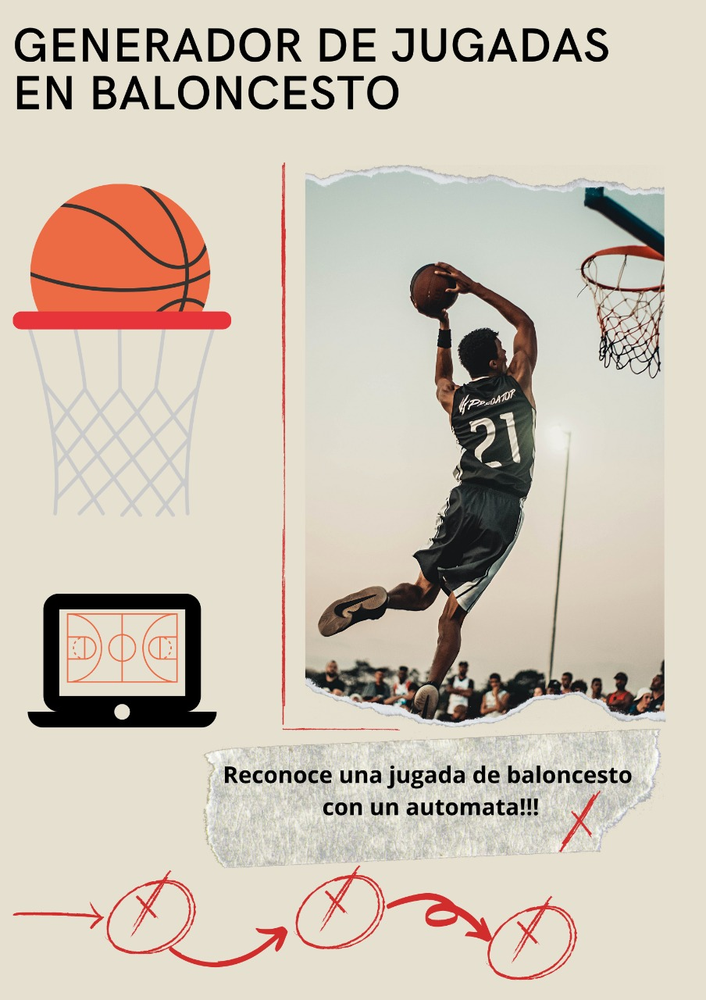

# Generador-De-Jugadas-De-Baloncesto

proyecto realizado para el curso de automatas y lenguajes formulas de la universidad industrial de santander

## descripcion

el proyecto fue realizado en un notebook, el codigo genera jugadas correctas de baloncesto y reconoce la entrada de una jugada haciendo uso de automatas finitos deterministas  

*link al video presentacion* : [https://youtu.be/MllbK-Xe0fI](https://youtu.be/MllbK-Xe0fI)

*notebook*: [generador-de-jugadas-de-baloncesto](Proyecto_Automatas.ipynb)

